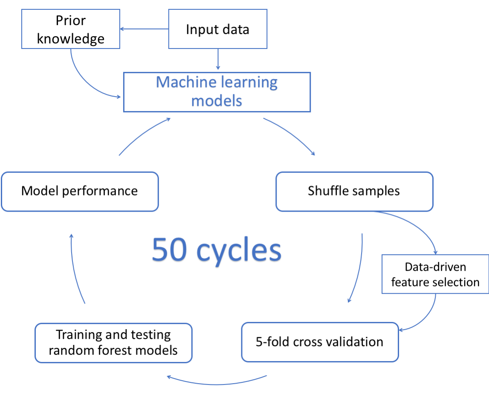

# 3G (Gut, Grain, Greens) weight loss prediction
This code is used in the paper "Data integration for prediction of weight loss in randomized controlled dietary trials" by Rikke L. Nielsen et al [1]. 

The models here are random forest  binary classifiers. In order to run the program, one must first save all input and target data as pandas DataFrames or series and save them as a dict in a binary file using the Python package "pickle". Furthermore, the program is depended on all data being saved with the features as columns and samples as rows, where the sample IDs are of identical dtypes, e.g. all are floats. 

Python dependencies required to run this is: 
- Python 3.7.1
- Scikit-learn version 0.20.1
- Pandas version 0.23.4
- Numpy version 1.15.4
- Joblib version 0.13.2
- Argparse version 1.1

## Running the main program
The main program will train and test random forest binary classifiers based on the input data contained in "load_data.pickle" and use the keys of this pickled dictionary as filenames. 

The models are run in terminal by: 

```console
python scripts/main.py --input_labels diet <other data sets> --target_label target [OPTIONAL FLAGS]
```
Above, the data set named "diet" is used as an example. The program has been implemented with the following flags: 
- ```-i``` or ```--input_labels``` specifies the keys which will extract the selected data set from a saved binary pickle file, containing a Python dict of all data sets. This flag is required. 
- ```-t``` or ```--target_label``` which specifies the target data to use. This must be saved in the Python dict in "load_data.pickle" as a single column pandas DataFrame or Series. Default is ```target```
- ```-s``` or ```--states``` specifies the number of random states to run. The random states will only change the CV folds, not the model initializations. If no states are specified, the following 50 states will be used: ```random_states = [654, 114, 25, 759, 281, 250, 228, 142, 754, 104, 692, 758, 913, 558, 89, 604, 432, 32, 30, 95, 223, 238, 517, 616, 27, 574, 203, 733, 665, 718, 429, 225, 459, 603, 284, 828, 890, 6, 777, 825, 163, 714, 348, 159, 220, 980, 781, 344, 94, 389]```. 
- ```-cv``` or ```--cv_splits``` is the number of cross validation folds to use in the one-layer cross validation. 
- ```-for``` or ```--forwards``` is one or more integers corresponding to the label number from the ```--input_labels``` where features of the model should be forwards selected. This is zero-indexed positions. Default is ```False``` and then no forward selection is applied and all loaded features are included in the model. 
- ```-dir``` or ```--directory``` states the directory where the results and model information are saved. Default is the current directory from where the program is run. 
- ```-per``` or ```--permute``` stores true, if the random forests should be trained on a permuted target, in order to test for overfit, i.e. save the performances and check if there is a significant difference between the ROC-AUC performances when trained on a permuted target vs the ROC-AUC performances when trained on the true target. 
- ```-samples``` or ```--samples``` is a string denoting the path to a one-line comma-separated file, containing IDs of samples to use when training the models. Default is ```False```, meaning that all samples in the intersection of selected datasets are included. 
- ```-w``` or ```--wkdir``` is the working directory where the binary pickle file "load_data.pickle" containing the input data is located.  
- ```-v``` or ```--verbose``` sets verbose on. 

The output of this program will be model performances, parameters and random forest Gini feature importances saved as binary pickled files (".model") per random state. Furthermore, this will save a ".features" file containing the names of the features used in the final model. 

The model flow is depicted in the below figure is from [1]. The features for the models either go directly or have feature selection applied either by prior knowledge using known biology or a data-driven forward selection of features. The models are random forest binary classifiers trained and tested using 50 times of 5-fold shuffle-split cross-validations. 



## Ensemble models
A Jupyter notebook has been made showing how to score ensemble models based on the output files of the above main program. 


## Reference
[1] *Data integration for prediction of weight loss in randomized controlled dietary trials*

Rikke Linnemann Nielsen<sup>\*</sup>, Marianne Helenius<sup>\*</sup>, Sara Garcia, Henrik M. Roager, Derya Aytan-Aktug, Lea Benedicte Skov Hansen, Mads Vendelbo Lind,  Josef K. Vogt, Marlene Danner Dalgaard, Martin I. Bahl,  Cecilia Bang Jensen, Rasa Muktupavela, Christina Warinner, Vincent Appel, Rikke Gøbel, Mette Kristensen, Hanne Frøkiær, Morten H. Sparholt, Anders F. Christensen, Henrik Vestergaard, Torben Hansen, Karsten Kristiansen,  Susanne Brix, Thomas Nordahl Petersen, Lotte Lauritzen<sup>\*\*</sup>, Tine Rask Licht<sup>\*\*</sup>, Oluf Pedersen<sup>\*\*</sup>, Ramneek Gupta<sup>\*\*</sup>

\* These authors contributed equally

\*\* Corresponding authors


